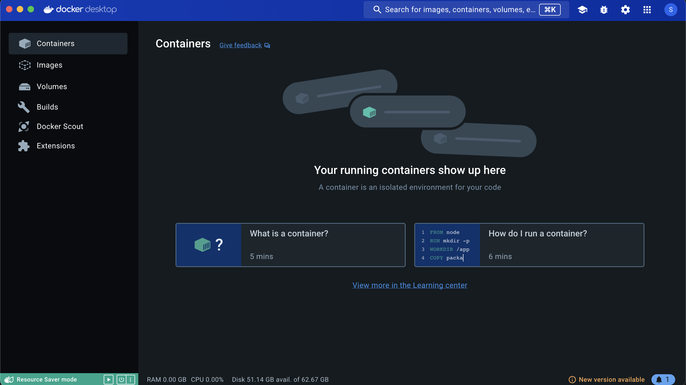
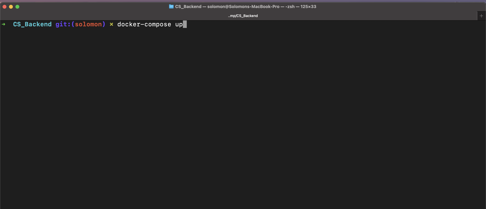
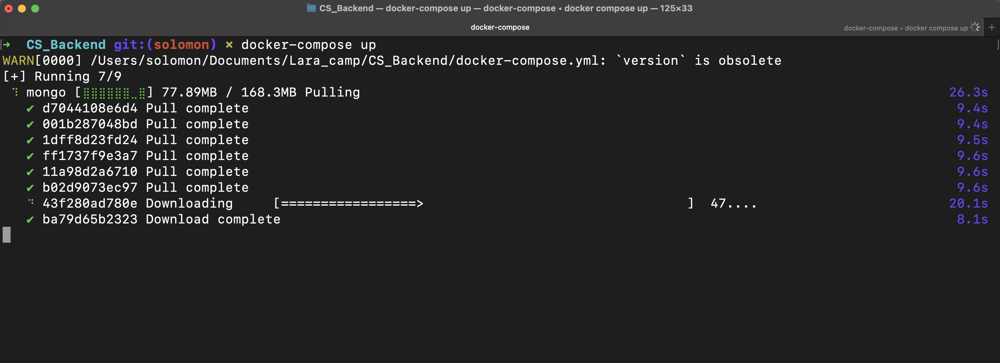
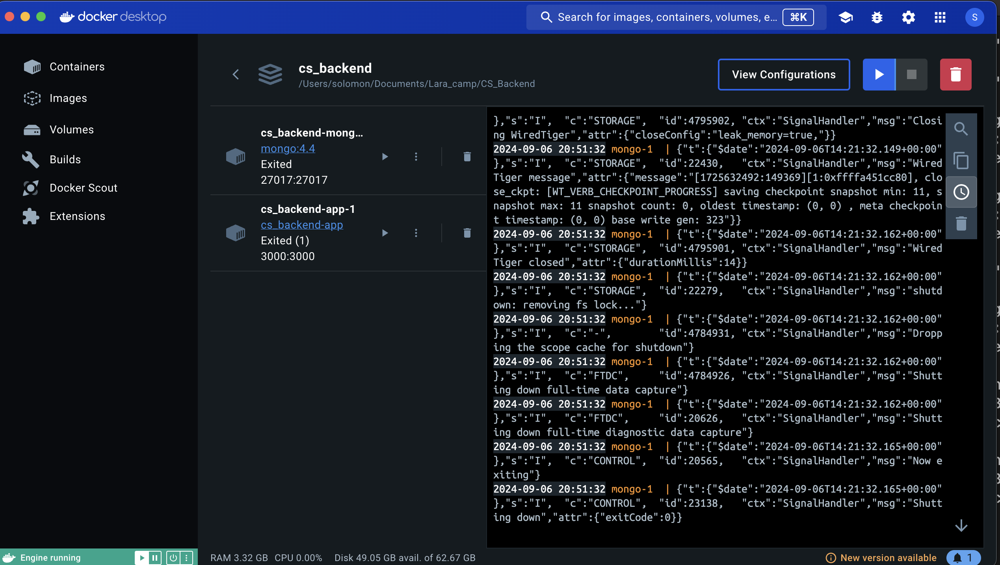
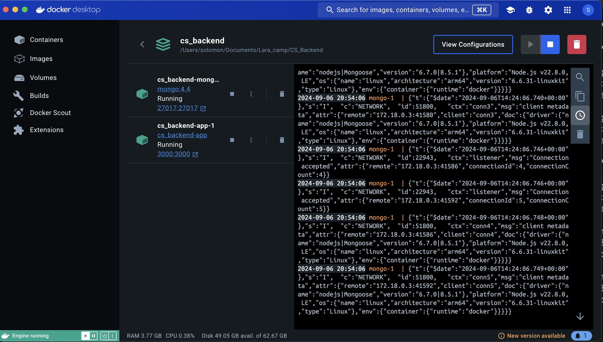
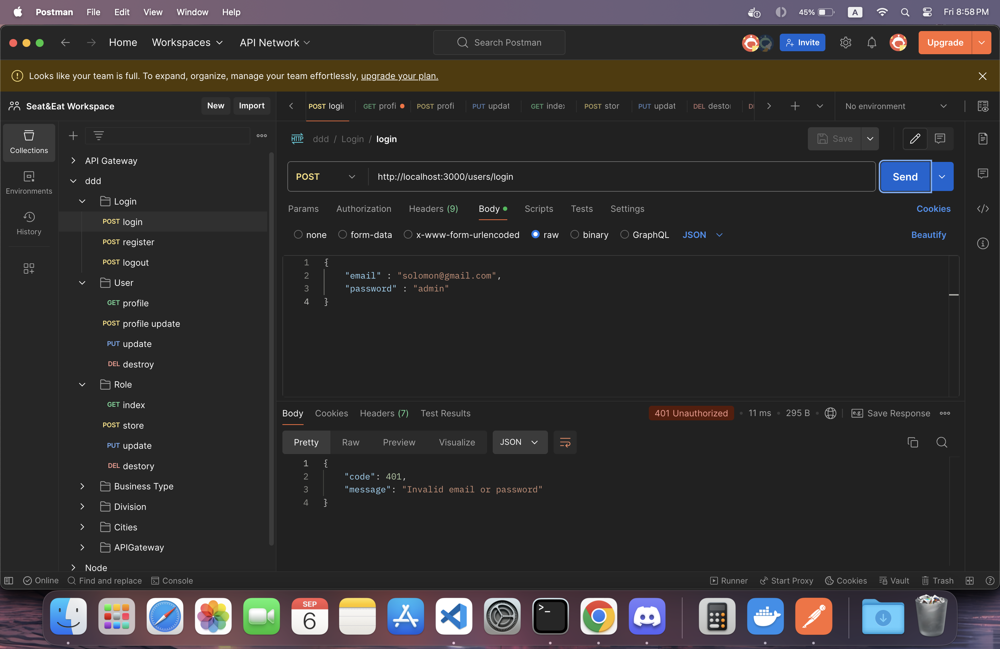

# Docker Installation, Project Clone, and Running Project with Docker

## Step 1: Install Docker

1. **Install Docker on Windows, macOS, or Linux:**

   - **Windows:**
     - Download Docker Desktop from [Docker’s official site](https://www.docker.com/products/docker-desktop).
     - Run the installer and follow the on-screen instructions.
     - After installation, open Docker Desktop.

   - **macOS:**
     - Download Docker Desktop from [Docker’s official site](https://www.docker.com/products/docker-desktop).
     - Open the `.dmg` file and drag Docker to the Applications folder.
     - Launch Docker from Applications.

   - **Linux (Ubuntu example):**
     ```bash
     sudo apt update
     sudo apt install docker.io
     sudo systemctl start docker
     sudo systemctl enable docker
     sudo usermod -aG docker $USER  # Optional: Avoid using sudo with Docker
     ```

2. **Verify Docker Installation:**
   Run the following command in your terminal or command prompt to ensure Docker is installed correctly:
   ```bash
   docker --version

3. **Clone Project**
    Open a Terminal or Command Prompt.
    cd /path/to/your/directory
    git clone https://github.com/Jap-syn/CS_Backend.git
    cd CS_Backend

4. **Build and Run the Project with Docker**
    Run docker-compose up

    
    
    
    
    
    


